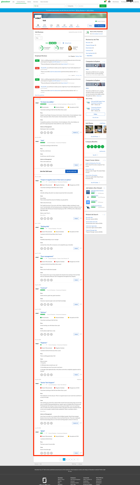
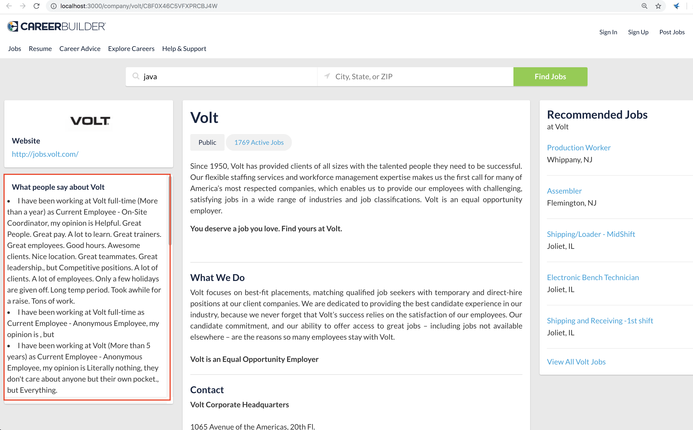
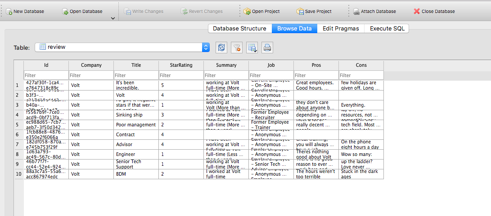
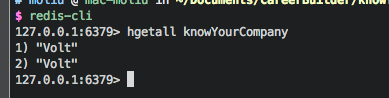

# Know your Company

We want to empower the job seekers to know more about the companies they are interested in.

## Typical Use case

1. job seekers search for a job
2. job seekers check the company info page
3. careerbuilder backend checks if the comments already in the database  
    3.1 careerbuilder backend issues the glassdoor webspider to scrape the comments
4. careerbuilder backend retrieves the comments and renders it on the webpage 

## The product

## Infrastructure
for simplicity, we use sqlite3 as the database

we also use redis to check if the compnay exists in the db

